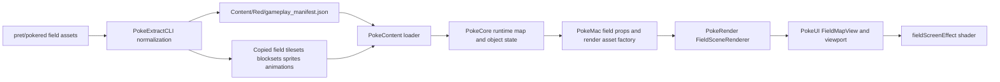

# Field Rendering Pipeline

This document explains how the overworld field is rendered in PokeSwift, from extracted Pokemon Red assets all the way to the native SwiftUI viewport and the final screen shader pass.

It is written as a technical walkthrough rather than a terse API reference. The goal is to help a human understand the full pipeline, why it is split across modules, and where each responsibility lives.

## Why This Exists

The field renderer is intentionally split across multiple modules:

- `PokeExtractCLI` reads and normalizes the original `pret/pokered` field assets and metadata.
- `PokeDataModel` defines the runtime-friendly map, tileset, sprite, and animation schemas.
- `PokeContent` loads the extracted manifests and validates that the required assets exist.
- `PokeCore` owns gameplay state, object positions, camera-driving movement, and the decision of which map and actors should currently be visible.
- `PokeRender` turns field assets plus runtime state into rendered images and prepared sprite frames.
- `PokeUI` presents that rendered scene in SwiftUI, animates movement, and applies the display shader.
- `PokeMac` builds the viewport props that bridge loaded content and runtime state into the field scene.

That split matters because the app does **not** parse Game Boy source files at runtime. The native app only consumes extracted artifacts from `Content/Red/`.

## The Big Picture

At a high level, the flow looks like this:

There are really two linked parts to the system:

- A source-driven extraction path that exports the field assets and metadata in a runtime-friendly form.
- A native render path that draws a padded background image, animated tile overlay, and actor sprites, then runs the shared gameplay screen shader over the result.

## 1. Reading The Original Field Assets

The extraction entry points live in:

- `Sources/PokeExtractCLI/RedContentExtractor.swift`
- `Sources/PokeExtractCLI/GameplayExtraction.swift`
- `Sources/PokeExtractCLI/GameplayMapExtraction.swift`
- `Sources/PokeExtractCLI/GameplaySpriteExtraction.swift`

The extractor reads a mix of binary assets and source metadata from `pret/pokered`, including:

- `gfx/tilesets/*.png`
- `gfx/blocksets/*.bst`
- `gfx/sprites/*.png`
- `gfx/tilesets/flower/*.png`
- `maps/*.blk`
- `data/maps/headers/*.asm`
- `data/maps/objects/*.asm`
- `data/maps/songs.asm`
- `data/tilesets/*.asm`
- `constants/map_constants.asm`

Those sources collectively describe:

- which tileset a map uses
- which blockset goes with that tileset
- the map's block dimensions and step dimensions
- the block IDs for the map layout
- the collision and ledge metadata for the tileset
- map warps, object placement, and background events
- map default music
- overworld sprite frame rectangles
- tileset animation metadata like water and flower animation tiles

### Tilesets And Blocksets Are Copied, Not Rebuilt

`RedContentExtractor.fieldAssetMap` in `Sources/PokeExtractCLI/RedContentExtractor.swift` copies the native field art directly into `Content/Red/Assets/field/`.

That includes:

- tileset PNGs such as `Assets/field/tilesets/overworld.png`
- blockset binaries such as `Assets/field/blocksets/overworld.bst`
- overworld sprite sheets such as `Assets/field/sprites/red.png`

For field rendering, the key idea is that the runtime uses the original raster assets, while the manifest tells it how to interpret them.

### Tile Animation Frames Are Exported Separately

`RedContentExtractor.tilesetAnimationAssetMap` copies the flower animation frames into:

- `Assets/field/tileset_animations/flower/flower1.png`
- `Assets/field/tileset_animations/flower/flower2.png`
- `Assets/field/tileset_animations/flower/flower3.png`

Those files are referenced from the extracted tileset animation metadata and later loaded by the runtime as overlay frames.

### Maps Become Runtime Manifests

The extractor does not copy `.blk` files into runtime content directly. Instead, it reads them and embeds the decoded block IDs into `gameplay_manifest.json`.

At a high level, each `MapManifest` includes:

- `id`
- `tileset`
- `defaultMusicID`
- `blockWidth` and `blockHeight`
- `stepWidth` and `stepHeight`
- `blockIDs`
- `stepCollisionTileIDs`
- warps, background events, objects, and map connections

That means the runtime does not have to reopen raw map block binaries to know which blocks to draw.

### Sprite Sheets Become Explicit Frame Rectangles

`Sources/PokeExtractCLI/GameplaySpriteExtraction.swift` builds `OverworldSpriteManifest` values for each supported field sprite.

For character sprites, `buildCharacterSprite(...)` emits:

- `facingFrames.down`
- `facingFrames.up`
- `facingFrames.left`
- `facingFrames.right`
- optional `walkingFrames`

The important design choice is that the runtime does not infer sprite frame layout from heuristics. The extractor encodes the exact `PixelRect` values in the manifest up front.

## 2. What Gets Written To Content/Red

Field rendering depends primarily on:

- `Content/Red/gameplay_manifest.json`
- `Content/Red/Assets/field/tilesets/*.png`
- `Content/Red/Assets/field/blocksets/*.bst`
- `Content/Red/Assets/field/sprites/*.png`
- `Content/Red/Assets/field/tileset_animations/flower/*.png`

`gameplay_manifest.json` is the structured contract. The copied assets are the raw art and block data the renderer consumes.

For field rendering, the most important manifest sections are:

- `tilesets`
- `maps`
- `overworldSprites`

## 3. Content Loading And Validation

`Sources/PokeContent/Loading/ContentLoading.swift` loads `gameplay_manifest.json` into a `GameplayManifest` and validates the field asset paths before runtime ever tries to render a map.

The loader verifies:

- tileset `imagePath`
- tileset `blocksetPath`
- animated tile `frameImagePaths`
- overworld sprite `imagePath`

That validation is important because the field pipeline depends on several file families that have to stay in sync:

- JSON map metadata
- PNG tilesets
- BST blocksets
- PNG overworld sprites
- animation frame PNGs

`LoadedContent` then exposes helpers like:

- `map(id:)`
- `tileset(id:)`
- `overworldSprite(id:)`

So the runtime can stay manifest-driven instead of manually building file paths all over the codebase.

## 4. How Runtime State Becomes Render Assets

By the time field rendering starts, `PokeCore` already knows:

- the current map
- the player's tile position and facing
- which field objects are visible
- which sprite IDs are needed for the current scene

`App/PokeMac/Sources/Scenes/Gameplay/GameplayFieldScenePropsFactory.swift` builds `GameplayFieldViewportProps` from that runtime state.

For the render-specific bridge, `App/PokeMac/Sources/Adapters/FieldRenderAssetFactory.swift` converts loaded content into `PokeRender` types:

- `FieldTilesetDefinition`
- `FieldSpriteDefinition`
- `FieldRenderAssets`

### Tileset Conversion

`makeFieldRenderAssets(runtime:)` converts the current `TilesetManifest` into `FieldTilesetDefinition` by wiring:

- `imageURL`
- `blocksetURL`
- `sourceTileSize`
- `blockTileWidth`
- `blockTileHeight`
- `FieldTilesetAnimationDefinition`

Animated tile frame paths are resolved into absolute `URL`s relative to `runtime.content.rootURL`.

### Sprite Conversion

The same factory converts each `OverworldSpriteManifest` into a `FieldSpriteDefinition` by preserving:

- sprite sheet `imageURL`
- frame size
- facing frames
- optional walking frames
- horizontal flip metadata

At the end of this step, `PokeRender` has everything it needs in a rendering-friendly form, without knowing anything about extractor-specific path conventions.

## 5. Entering The Field View Hierarchy

The field stage is assembled like this:

- `App/PokeMac/Sources/Scenes/Gameplay/GameplayScene.swift`
- `App/PokeMac/Sources/Scenes/Gameplay/GameplayFieldStageView.swift`
- `Sources/PokeUI/Scenes/Field/FieldMapView.swift`

`GameplayScene` chooses the field stage when the current viewport is `.field(...)`.

`FieldStageView` then embeds `FieldMapView` inside the Game Boy shell and overlays:

- dialogue boxes
- healing overlays
- field prompts
- shop overlays
- starter choice overlays

That means the field renderer itself stays focused on map pixels and actor sprites, while the shell and modal UI remain separate SwiftUI layers.

## 6. `FieldMapView` Owns Presentation State

`Sources/PokeUI/Scenes/Field/FieldMapView.swift` is the main field rendering view.

It does two important jobs:

- asks `PokeRender` to render a `FieldRenderedScene`
- maintains the presented camera and actor positions so movement can animate smoothly in SwiftUI

### Off-Main-Thread Scene Rendering

When `sceneRenderSignature` changes, `FieldMapView` starts a detached task and calls:

- `FieldSceneRenderer.renderScene(...)`

The returned `FieldRenderedScene` is then published back to SwiftUI state.

That split is important:

- expensive image composition happens off the main actor
- camera and position interpolation still live in SwiftUI-friendly state on the main actor

### Presented Versus Logical Positions

`syncPresentedState(metrics:)` computes:

- `presentedCameraOrigin`
- `presentedPlayerWorldPosition`
- `presentedObjectWorldPositions`

These are derived from the current logical tile positions using `FieldSceneRenderer.playerWorldPosition(...)` and `FieldCameraState.target(...)`.

When movement should animate, `FieldMapView` uses a linear SwiftUI animation over `playerStepDuration`. When it should snap, it disables animation with a transaction.

So the render scene itself is mostly static image content, while the camera and actor transforms are what make it feel live.

## 7. `FieldSceneRenderer` Builds The Scene

The core renderer lives in `Sources/PokeRender/Rendering/FieldRendering.swift`.

The field pipeline uses a few important constants:

- `tilePixelSize = 8`
- `stepPixelSize = 16`
- `blockPixelSize = 32`
- `viewportPixelSize = 160 x 144`

Those values encode the Game Boy-sized viewport and the map-to-pixel conversion rules the rest of the field pipeline uses.

### The Rendered Scene Structure

`FieldSceneRenderer.renderScene(...)` returns a `FieldRenderedScene` containing:

- the `mapID`
- `metrics`
- `tileset`
- a fully rendered `backgroundImage`
- `animatedTilePlacements`
- `actors`

This is a crucial design choice: the background is precomposed into a single image, while dynamic tile animations and actors stay as separate layers for cheap per-frame updates.

### Background Rendering

The static map background is built by:

- decoding the blockset from the `.bst`
- preparing a tileset atlas from the tileset PNG
- enumerating map blocks and their contained 8x8 tiles
- drawing those tiles into a padded image buffer

That process is driven by:

- `FieldBlockset.decode(...)`
- `preparedAtlas(for:)`
- background tile enumeration helpers
- `drawPaddedBackground(...)`

The result is a single `CGImage` for the whole visible map content region, not a tile-by-tile SwiftUI grid.

### Why The Background Is Padded

The renderer uses padded scene metrics so scrolling near map edges still works cleanly and transitions have stable pixel coordinates.

The camera then moves over that content image by offsetting it inside the fixed 160x144 viewport.

## 8. Animated Tiles Are A Separate Overlay

Animated field tiles are not baked into the static background image.

Instead:

- `FieldSceneRenderer.renderScene(...)` records `animatedTilePlacements`
- `FixedViewportRenderedField` recomputes the current visual state in a `TimelineView`
- `FieldSceneRenderer.animatedOverlayImage(for:visualState:)` draws only the animated tile layer

This split is what lets:

- the static background stay cached
- water and flower tiles keep animating at runtime
- camera scrolling remain smooth without rerendering the whole scene every frame

### Water And Flower Animation

`FieldTilesetAnimationDefinition` distinguishes:

- `.none`
- `.water`
- `.waterFlower`

At runtime, `tileAnimationVisualState(...)` derives frame indices from the visible field frame count, and the overlay renderer chooses the correct water or flower frame for each animated tile placement.

For water, the runtime can derive the eight-frame sequence from the base tile. For flowers, it uses the copied frame PNGs exported into `Assets/field/tileset_animations/flower/`.

## 9. Actor Sprites Are Prepared Once, Positioned Live

Actors in the field scene include:

- the player
- field objects and NPCs

For each actor, `FieldSceneRenderer` resolves:

- sprite definition
- facing frame
- optional walking frame
- world position
- rendered size

Prepared sprite images are cached by `FieldRendererCaches`, so the runtime is not cropping the same sprite sheet rectangle over and over every frame.

### Facing And Walking Frames

`FieldSpriteDefinition.frame(for:isWalking:)` chooses the appropriate `FieldSpriteFrame`.

Then `FixedViewportRenderedField` decides whether to show:

- the standing frame
- the walking frame

based on `FieldMapView.playerWalkAnimationPhase(...)` and the equivalent object-step animation state.

For the player, mirrored walking frames are also handled as a presentation detail so right-facing walk animation can reuse extracted art efficiently.

## 10. Camera And Coordinate Conversion

The field pipeline moves through three coordinate spaces:

- map/block coordinates
- step/world pixel coordinates
- on-screen viewport coordinates

### Tile Position To World Pixels

`FieldSceneRenderer.playerWorldPosition(for:metrics:)` converts a tile position into world-space pixels using:

- `stepPixelSize`
- scene padding

Conceptually:

- each gameplay step is 16 pixels
- padding is added so the camera math works against the padded content image

### World Pixels To Camera Origin

`FieldCameraState.target(...)` centers the camera on the player by computing:

- desired player-centered origin
- then clamping that origin to the valid content bounds

So the player is usually centered, but the camera stops panning once it reaches the edge of the map content.

### Camera Origin To Screen Position

In `FixedViewportRenderedField`, the static background and animated overlay are both rendered at full content size and then shifted by:

- `-cameraOrigin.x * displayScale`
- `-cameraOrigin.y * displayScale`

Actors are positioned by subtracting the same `cameraOrigin` from their world-space position, then converting to scaled SwiftUI coordinates inside the fixed viewport.

## 11. `FixedViewportRenderedField` Composes The Final SwiftUI Scene

The actual field viewport composition lives in `Sources/PokeUI/Scenes/Field/FieldRenderedViewportView.swift`.

The order is:

1. LCD-colored background rectangle
2. static background image
3. animated tile overlay image
4. actor sprites
5. field alert bubble
6. gameplay screen effect shader
7. transition overlay

That ordering matters because:

- actors must appear above the tile layers
- animated water/flower overlays must sit above the static background but below actors
- the gameplay shader should affect the whole composed field image

### Z Ordering Of Actors

Actors use their world-space `y` value as `zIndex`, so sprites lower on the screen sort above sprites higher on the screen.

That is the simple but important trick that gives the field depth ordering expected from classic top-down RPG scenes.

## 12. The Shader Pass

The field display effect is shared with other gameplay scenes.

The SwiftUI-side entry point lives in:

- `Sources/PokeRender/Effects/FieldScreenShader.swift`
- `Sources/PokeRender/Effects/FieldScreenEffects.metal`

The field viewport applies:

- `.gameplayScreenEffect(displayStyle:displayScale:hdrBoost:)`

When there is no active battle presentation, `GameplayScreenEffectModifier` routes to `FieldScreenEffectModifier`, which uses:

- `FieldScreenShader.function`
- the Metal shader named `fieldScreenEffect`

### What The Field Shader Does

The field shader is a post-process pass over the already composed viewport image. It is responsible for the display treatment, not gameplay layout.

At a high level it applies:

- the selected field display preset
- LCD-style presentation treatment
- the current pixel scale
- HDR boost tuning from the active gameplay appearance profile

The practical effect is that field rendering stays separated into:

- scene composition in `PokeRender` and `PokeUI`
- display simulation in the final shader pass

That is why the field scene can share the same presentation model with battle and evolution while still using a different final shader mode.

## 13. Validation And Test Coverage

The main automated coverage for the field pipeline lives in:

- `Tests/PokeRenderTests/FieldRenderingTests.swift`
- `Tests/PokeUITests/FieldViewMotionTests.swift`
- `Tests/PokeUITests/ShellAndSidebarTests.swift`

Those tests cover the most important boundaries in the field renderer:

- static map/background composition
- animated tile overlay generation
- sprite layering and positioning
- camera and motion behavior in the SwiftUI field viewport
- shell integration for the field stage

## 14. What The Field Renderer Is, And What It Is Not

This pipeline is:

- source-driven
- manifest-based
- image-composited
- camera-aware
- shader-finished

This pipeline is not:

- a runtime `.asm` parser
- a tile-by-tile SwiftUI grid
- a per-frame full rerender of the entire map

Instead, it is a hybrid pipeline:

- extract and validate everything up front
- precompose the static field image
- keep animated tiles and actors separate
- move the camera and actors in SwiftUI
- finish with a shared gameplay screen shader

## Debugging Strategy

When field rendering looks wrong, the fastest way to localize it is:

1. Check whether the extracted asset and manifest paths are correct in `Content/Red/`.
2. Confirm the current `MapManifest`, `TilesetManifest`, and `OverworldSpriteManifest` values look sane.
3. Verify `makeFieldRenderAssets(runtime:)` is building the right URLs and frame rectangles.
4. Check whether the issue is in static background composition, animated tile overlay, or actor presentation.
5. Only then investigate the final shader or shell presentation.

For this codebase, many field bugs come from the contract between extracted metadata and renderer expectations, not from SwiftUI layout alone.

## Extension Guidelines

If you extend the field renderer, keep these rules in mind:

- Preserve the extractor/runtime contract in `GameplayManifest`.
- Prefer source-driven fixes over hardcoded runtime map special cases.
- Keep rendering responsibilities in `PokeRender` and `PokeUI`; do not move gameplay state logic into the view layer.
- Keep the field shader as a post-process, not a substitute for correct scene composition.
- Validate both extraction and runtime when touching sprite frames, blocksets, tileset animations, or world-to-pixel math.

## Summary

PokeSwift's field renderer is a source-driven native pipeline built from extracted Pokemon Red content rather than runtime source parsing.

The extractor copies the original tilesets, blocksets, sprite sheets, and animation frames while writing map and sprite metadata into `gameplay_manifest.json`. `PokeContent` validates and loads that data, `PokeCore` provides the current scene state, `PokeMac` adapts that into render assets, `PokeRender` composes the background and prepares actor images, and `PokeUI` animates movement, scrolls the camera, layers animated tiles and sprites, and applies the shared field screen shader before the final pixels hit the display.
